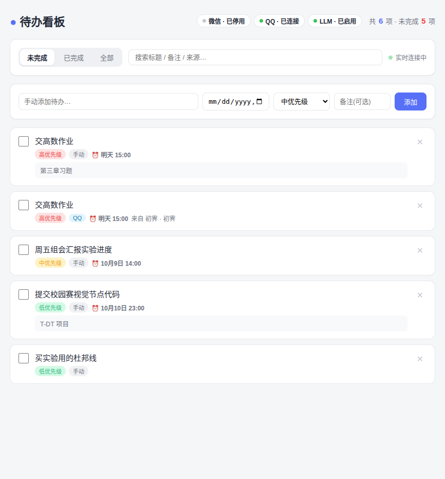

<p align="center">
  
  
  
  
  
  
</p>

<h1 align="center">📝 msg2todo</h1>
<p align="center"><b>实时接收 QQ(和微信)消息 → LLM 智能提取待办 → 桌面看板 + 手机推送</b></p>
<p align="center">全免费 · 数据不出本机 · 支持 Linux / Windows</p>

<p align="center">
  
</p>

> *English:* A self-hosted bot that turns QQ (and WeChat) messages into todos.
> OneBot v11 bridge → LLM extraction → SQLite → Electron dashboard → iOS/Android push.
> Everything is free and your data never leaves your machine.

---

## 目录

- [功能特性](#功能特性)
- [工作原理](#工作原理)
- [架构详解](docs/架构说明.md) ⭐ 想读懂源码?先看这篇
- [快速开始](#快速开始)
- [QQ 接入(OneBot v11)](#qq-接入onebot-v11)
- [课表功能](#课表功能) ⭐ 学生提供课表,每晚提醒第二天课程
- [番茄钟](#番茄钟) 专注计时 + 手机提醒
- [天气推送](#天气推送) 每日天气 + 带伞穿衣提示
- [倒计时](#倒计时) 考试/放假天数提醒
- [上课前提醒](#上课前提醒) 课前 10 分钟推送
- [Excel 课表导入](#excel-课表导入) 发 xlsx 文件自动导入
- [每周回顾](#每周回顾) 周日推送本周总结
- [睡觉提醒](#睡觉提醒) 就寝时间提醒
- [微信接入(已停用,附说明)](#微信接入已停用附说明)
- [LLM 配置](#llm-配置openai-兼容接口)
- [手机使用:看板 + 推送](#手机使用看板--推送)
- [全部配置项](#全部配置项)
- [使用示例](#使用示例)
- [打包与分发](#打包与分发)
- [手机 App(安卓安装包)](#手机-app安卓安装包)
- [App 原生推送(Web Push,不依赖 QQ)](#app-原生推送web-push不依赖-qq)
- [更新升级](#更新升级)
- [本地测试](#本地测试无需真实-qq)
- [常见问题](#常见问题)
- [项目结构](#项目结构)
- [License](#license)

---

## 功能特性

| | 特性 | 说明 |
|---|------|------|
| 🤖 | **QQ 机器人** | OneBot v11 反向 WebSocket;支持 [LLOneBot](https://github.com/LLOneBot/LLOneBot)(Windows)和 [NapCatQQ](https://github.com/NapNeko/NapCatQQ)(Linux) |
| 📚 | **课表提醒** | 学生私聊发课表 → 智能解析(支持单双周/周次)→ **每晚自动私聊提醒第二天的课程**,可绑定手机推送 |
| 🍅 | **番茄钟** | 发「番茄 25」开始专注,到点 QQ+手机提醒,支持多轮自动循环、每日统计 |
| 🌤 | **天气推送** | 每天早晨推送今日+明日天气与穿衣带伞提示(Open-Meteo 免费接口,无需 Key) |
| ⏳ | **倒计时** | 考试/放假倒计时,每天推送剩余天数,考前 7/3/1 天重点提醒 |
| 🔔 | **上课前提醒** | 每节课前 10 分钟 QQ+手机提醒(课表自动生成,可关闭) |
| 📥 | **Excel 课表导入** | 直接发教务系统导出的 xlsx 文件给机器人,自动解析入库 |
| 📊 | **每周回顾** | 周日晚推送本周总结:待办/番茄/课程/倒计时 |
| 🌙 | **睡觉提醒** | 自定义就寝时间提醒,第二天有早八会提示别熬夜 |
| 🧠 | **智能提取** | 本地大模型(如 Qwen2.5-3B,GPU 推理)或任意 OpenAI 兼容 API;无 LLM 时自动降级为内置中文规则(支持「明天/周五/下午3点/3小时后」等表达) |
| 🖥️ | **桌面软件** | Electron 窗口内嵌看板、系统托盘、开机自启;也支持纯命令行模式 |
| 📱 | **手机看板** | PWA,浏览器「添加到主屏幕」即用 |
| 🔔 | **手机推送** | 新待办、**到期前 1 小时提前提醒**、到期提醒,实时推送到手机(Bark for iOS / PushDeer for Android) |
| 🤫 | **默认静默** | 生成待办不打扰发消息的人(可配置开启确认回复) |
| 🔒 | **隐私** | 数据全部本地存储;大模型可跑在本地显卡,消息不出本机 |

## 工作原理

```
┌──────────┐  反向 WebSocket   ┌──────────────────────────────┐
│ LLOneBot │ ────────────────► │  msg2todo                    │
│ /NapCat  │                   │  ├─ OneBot v11 服务 (ws:3001) │   LLM API
└──────────┘                   │  ├─ LLM / 本地规则提取        │   (云端/本地)
                               │  ├─ SQLite 存储              │
┌──────────┐                   │  ├─ 桌面看板 (Electron)      │
│ 微信      │ ──(已停用)──────► │  ├─ 手机看板 (PWA)           │
└──────────┘                   │  └─ 手机推送 (Bark/PushDeer) │
                               └──────────────────────────────┘
```

## 快速开始

> 要求:Node.js ≥ 22.5(内置 `node:sqlite`)

```bash
git clone https://github.com/WA295/msg2todo.git
cd msg2todo
npm install
cp .env.example .env      # 按需填写 LLM / 推送配置
npm run desktop           # 桌面版
# 或 npm start            # 纯命令行模式
```

启动后:看板在 `http://127.0.0.1:8080`,QQ 接入点在 `ws://127.0.0.1:3001`。

## QQ 接入(OneBot v11)

在 QQ 机器人插件中添加反向 WebSocket:

```
ws://127.0.0.1:3001        # 同机
ws://192.168.x.x:3001      # 跨机填局域网 IP
```

<details>
<summary><b>Linux 免 root 部署 NapCat(实测步骤,点击展开)</b></summary>

```bash
# 1. 下载 NapCat.Shell.zip(国内镜像):
curl -sL -o napcat.zip 'https://ghfast.top/https://github.com/NapNeko/NapCatQQ/releases/download/v4.18.30/NapCat.Shell.zip'
# 2. 复制 QQ 到用户目录并打补丁:
cp -a /opt/QQ ~/Applications/QQ-napcat
unzip -o napcat.zip -d ~/Applications/QQ-napcat/resources/app/app_launcher/napcat
echo "(async () => {await import('file:///$(echo ~)/Applications/QQ-napcat/resources/app/app_launcher/napcat/napcat.mjs');})();" > ~/Applications/QQ-napcat/resources/app/loadNapCat.js
node -e "const fs=require('fs');const p=process.env.HOME+'/Applications/QQ-napcat/resources/app/package.json';const j=JSON.parse(fs.readFileSync(p));j.main='./loadNapCat.js';fs.writeFileSync(p,JSON.stringify(j,null,2))"
# 3. 启动(首次需手机扫码,之后 -q 快速登录):
~/Applications/QQ-napcat/qq --no-sandbox -q <你的QQ号>
# 4. 首次登录后,把反向 WS 写入配置(文件名里的数字换成你的 QQ 号):
node -e "const fs=require('fs');const p=process.env.HOME+'/Applications/QQ-napcat/resources/app/app_launcher/napcat/config/onebot11_<QQ号>.json';const c=JSON.parse(fs.readFileSync(p));c.network.websocketClients=[{name:'msg2todo',enable:true,url:'ws://127.0.0.1:3001',messagePostFormat:'array',reportSelfMessage:false,reconnectInterval:5}];fs.writeFileSync(p,JSON.stringify(c,null,2))"
# 5. 重启 QQ 生效
```
</details>

### 行为规则

- **私聊**:所有消息交给 LLM 判断是否含待办
- **群聊**:默认只处理 **@机器人** 的消息;`QQ_PROCESS_ALL_GROUP=true` 处理全部群消息
- **群白名单**:`QQ_GROUP_WHITELIST=群号1,群号2` —— 白名单内的群**所有消息都处理**(不受 @ 限制),适合班级群、工作群
- **静默**:默认不回复发送者;`REPLY_CONFIRM=true` 开启确认回复

## 课表功能

学生私聊机器人发送课表,机器人智能解析后,**每天晚上自动私聊提醒学生第二天的课程**,支持单双周/周次判断,可绑定个人手机推送。

### 学生用法

```
课表                                    ← 整体覆盖课表(可多行)
周一 08:00-09:40 高等数学 @一教101
周一 10:00-11:40 大学英语 1-16周
周二 14:00-15:40 物理实验 双周
周三 08:00-09:40 程序设计 @机房B204 3-16周
```

| 指令 | 说明 |
|------|------|
| `课表` + 课程行 | 设置课表(整体覆盖);格式:`周X HH:MM-HH:MM 课程名 @地点 [周次] [单/双周]` |
| `添加课` + 课程行 | 追加课程,不清空已有课表 |
| `我的课表` | 查看自己的课表 |
| `明天什么课` / `今天什么课` | 立即查询当天/明天课程 |
| `开学日期 2026-02-23` | 设置开学日期(所在周为第 1 周),单双周/周次判断用 |
| `提醒时间 21:30` | 自定义每晚提醒时间(默认全局 `SCHEDULE_NOTIFY_TIME`) |
| `设置推送 <key>` | 绑定手机推送:Bark 完整地址(iOS)或 PushDeer 的 `PDU` 开头 key(安卓) |
| `取消推送` | 解除手机推送绑定 |
| `清空课表` | 删除自己的全部课程 |
| `课表帮助` | 查看完整说明 |

课程行示例(周次和单双周可省略):

```
周一 08:00-09:40 高等数学               ← 每周都上
周一 10:00-11:40 大学英语 1-16周        ← 只在第 1-16 周
周二 14:00-15:40 物理实验 双周           ← 只在双周
周四 19:00-20:40 形势与政策 5-8周单周    ← 第 5-8 周中的单周
```

解析规则:优先内置中文规则解析,解析失败时自动用 LLM(若已配置)。课表也可在网页看板的「📚 课表」页查看和管理。

### 每晚提醒

- 到点后机器人**私聊**学生:`📚 明天(10月8日 周四)· 第6周的课:` + 课程列表(含时间/地点/周次)
- 绑定过手机推送的学生,同一份提醒会**同时推送到手机**
- 没有开学日期时,周次/单双周课程会全部列出并提示设置开学日期
- 每个学生可以有自己的提醒时间(指令设置),未设置则用全局 `SCHEDULE_NOTIFY_TIME`(默认 21:00)

## 倒计时

考试、放假、四六级……一切"还有多少天"的事。

| 指令 | 说明 |
|------|------|
| `倒计时 2026-12-12 四六级` | 创建(也支持 `倒计时 12月12日 四六级`,自动补年份) |
| `倒计时` / `我的倒计时` | 查看全部倒计时与剩余天数 |
| `删除倒计时 1` | 按序号删除 |

- 每天 `COUNTDOWN_NOTIFY_TIME`(默认 08:00)推送剩余天数
- 剩 **7/3/1 天和到期日**重点提醒(`只剩 3 天!🔥`)
- 周报里也会带倒计时

## 上课前提醒

从课表自动生成:每节课前 10 分钟(全局 `CLASS_REMIND_MINUTES` 可调)QQ 私聊 + 手机推送「5 分钟后有课:高数 @1号A102」。默认所有学生开启。

## Excel 课表导入

学生把**教务系统导出的课表 xlsx 文件直接发给机器人**,自动解析导入(支持周次/单双周/教室/实验课),无需手打。当前内置东北大学节次时刻表,其他学校的时刻表可扩展 `src/excelImport.js` 里的 `TT` 常量。

## 每周回顾

每周日 `WEEKLY_REVIEW_TIME`(默认 22:00)自动推送本周总结:

```
📊 本周回顾(截至 10月11日)
✅ 完成待办 3 个 · 还剩 2 个 · 🍅 番茄 5 个 · 专注 2.1 小时 · 📚 上了 14 节课
⏳ 四六级 还有 62 天
💪 下周继续加油!
```

## 睡觉提醒

| 指令 | 说明 |
|------|------|
| `睡觉提醒 23:00` | 每天到点提醒 |
| `关闭睡觉提醒` | 取消 |

第二天 09:25 前有课(早八)时,会额外提示「明天有早八就别熬夜了」。

## 番茄钟

学习专注神器,基于消息 + 定时提醒,专注/休息自动循环。

| 指令 | 说明 |
|------|------|
| `番茄` | 开始默认 25 分钟专注 |
| `番茄 40` | 专注 40 分钟(1~180) |
| `番茄 25 5` | 专注 25 + 休息 5 分钟 |
| `番茄 25 5 4` | 4 轮自动循环:专注→休息→专注→… |
| `番茄统计` | 今日/累计番茄数与专注时长 |
| `结束番茄` | 取消进行中的番茄钟 |

- 每轮专注结束、休息结束都会 **QQ 私聊 + 手机推送**(绑定过推送的用户)
- 统计在看板「课表」页每个学生卡片上显示(🍅今日 N)

## 天气推送

每天定时推送今日 + 明日天气和生活提示(带伞/保暖/防晒等),数据来自 Open-Meteo 免费接口,无需申请 API Key。

| 指令 | 说明 |
|------|------|
| `天气` / `今天天气` | 查询当前城市天气 |
| `明天天气` | 查询明天天气 |
| `设置天气 沈阳` | 设置城市并开启每日推送(也可用全局 `WEATHER_CITY`) |
| `天气提醒 07:30` | 自定义推送时间(默认全局 `WEATHER_NOTIFY_TIME` = 07:00) |
| `关闭天气` / `开启天气` | 关闭/开启每日推送 |

- 管理员在 `.env` 配置 `WEATHER_CITY=学校所在城市`,所有学生自动获得每日天气推送
- 推送示例:`🌤 沈阳(辽宁)天气 · 10月8日 周四 / 此刻 15°C 体感 14°C · ☀️晴 / 今日:☀️ 晴 8~18°C · 降水20% · 风3级 / 明日:🌧 小雨 10~16°C · 降水70% · 风4级 / 💡 明天有雨,记得带伞 ☔`

## 微信接入(已停用,附说明)

> ⚠️ 个人微信的网页版协议已被微信官方封禁(服务器返回 1203「当前微信版本过低」),免费的 `wechat4u` puppet 已无法登录,**这不是本项目的 bug**。微信功能默认停用(`WECHAT_ENABLED=false`)。
>
> 替代方案:padlocal 付费 iPad 协议(`WECHAT_PUPPET=padlocal` + token),或企业微信官方 API。

## LLM 配置(OpenAI 兼容接口)

| 方式 | 配置示例 | 说明 |
|------|----------|------|
| 云端 API | `LLM_BASE_URL=https://api.deepseek.com` `LLM_API_KEY=sk-xxx` | 效果好,按量付费 |
| 本地 Ollama | `LLM_BASE_URL=http://127.0.0.1:11434/v1` `LLM_API_KEY=ollama` `LLM_MODEL=qwen2.5:7b` | 免费隐私,需显卡 |
| 本地 GPU 直跑 | Python + torch + Qwen2.5-3B(8GB 显存即可) | 免费隐私,无 Docker 依赖 |
| 不配置 | 留空 | 自动降级为内置中文规则 |

## 手机使用:看板 + 推送

**看板(PWA)**:手机浏览器打开 `http://<电脑IP>:8080` → 「添加到主屏幕」。需与电脑同一 WiFi。

**推送(任何网络,推荐)**:

| 平台 | App | 配置 |
|------|-----|------|
| iOS | [Bark](https://apps.apple.com/app/bark-customed-notifications/id1403753865) | `.env` 里 `BARK_URL=https://api.day.app/你的密钥` |
| Android | PushDeer | `.env` 里 `PUSHDEER_KEY=你的pushkey` |

新待办生成、待办到期都会实时推送到手机锁屏。

## 全部配置项

| 变量 | 默认 | 说明 |
|------|------|------|
| `LLM_BASE_URL` | `https://api.deepseek.com` | OpenAI 兼容接口地址 |
| `LLM_API_KEY` | 空 | API Key;为空时用本地规则 |
| `LLM_MODEL` | `deepseek-chat` | 模型名 |
| `TZ` | `Asia/Shanghai` | 解析"明天/下午3点"等相对时间的时区 |
| `WEB_HOST` / `WEB_PORT` | `0.0.0.0` / `8080` | 看板监听 |
| `QQ_ENABLED` | `true` | 是否启用 QQ |
| `ONE_BOT_WS_HOST` / `ONE_BOT_WS_PORT` | `0.0.0.0` / `3001` | OneBot 反向 WS |
| `ONE_BOT_ACCESS_TOKEN` | 空 | 接入令牌(可选) |
| `QQ_PROCESS_ALL_GROUP` | `false` | 是否处理 QQ 群全部消息 |
| `QQ_GROUP_WHITELIST` | 空 | 群白名单(逗号分隔群号):白名单内的群所有消息都处理,不受 @ 限制 |
| `WECHAT_ENABLED` | `true` | 是否启用微信(建议 false) |
| `TODO_KEYWORDS` | 空 | 关键词预过滤,如 `提醒,记得,待办` |
| `REPLY_CONFIRM` | `false` | 是否回复发送者确认 |
| `BARK_URL` | 空 | Bark(iOS)推送地址 |
| `PUSHDEER_KEY` | 空 | PushDeer(Android)pushkey |
| `REMIND_ADVANCE_MINUTES` | `60` | 到期前提前提醒(分钟);`0` = 只到点提醒 |
| `SCHEDULE_NOTIFY_TIME` | `21:00` | 每晚提醒第二天课程的时间(学生可单独设置) |
| `SCHEDULE_SEMESTER_START` | 空 | 全局默认开学日期(YYYY-MM-DD,可选;学生可单独设置) |
| `WEATHER_CITY` | 空 | 天气推送默认城市(如 沈阳);留空不启用,学生可单独设置 |
| `WEATHER_NOTIFY_TIME` | `07:00` | 每天推送天气的时间(学生可单独设置) |
| `CLASS_REMIND_MINUTES` | `10` | 上课前提前提醒(分钟) |
| `COUNTDOWN_NOTIFY_TIME` | `08:00` | 倒计时每日推送时间 |
| `WEEKLY_REVIEW_TIME` | `22:00` | 每周回顾推送时间(周日) |
| `VAPID_PUBLIC_KEY` / `VAPID_PRIVATE_KEY` | 空 | Web Push 密钥(生成见「App 原生推送」章节);配置后网页/App 可开启原生推送 |
| `VAPID_SUBJECT` | mailto | 推送服务联系方式 |
| `DB_PATH` | `data/todos.db` | SQLite 路径 |

## 使用示例

给机器人发(群里要 @机器人):

- 「明天下午3点提醒我交高数作业」
- 「周五下班前把实验报告发我,很重要」
- 「下周一上午9点半开组会,记得带电脑」
- 「3小时后提醒我吃药」

系统静默生成待办 → 存入看板 → 推送到手机(若已配置)。闲聊消息会被大模型/规则自动忽略。

## 打包与分发

```bash
npm run dist:linux                # Linux AppImage
npm run dist:win                  # Windows 安装包(需 wine)
bash scripts/install-desktop.sh   # Linux 免 FUSE 安装到应用菜单
```

## 手机 App(安卓安装包)

```bash
npm run build:apk                        # 打包(内置当前服务器地址)
SERVER=http://1.2.3.4:8080 TOKEN=xxx npm run build:apk   # 指定云端地址+访问密码
```

产物 `dist/msg2todo-安卓.apk`,装完打开即用(全屏无浏览器栏)。见 [云服务器部署](docs/云服务器部署.md) ⭐ 部署后手机在任何网络都能用。

## App 原生推送(Web Push,不依赖 QQ)

所有提醒可以**直达手机通知中心**,彻底摆脱对 QQ 的依赖(QQ 机器人被风控也不影响收提醒):

1. 配置域名 + HTTPS(见 [云服务器部署](docs/云服务器部署.md),Caddy 自动证书)
2. `.env` 配置 VAPID 密钥(生成:`node -e "console.log(require('web-push').generateVAPIDKeys())"`)
3. 打开网页/App → 总览页点「**🔔 开启推送**」→ 允许通知

支持:iPhone(iOS 16.4+,从主屏幕打开)、安卓、电脑浏览器。开启后,课表/天气/倒计时/待办/番茄/上课/睡觉提醒全部原生推送;QQ 私聊与 Bark/PushDeer 仍作为并行通道。

## 更新升级

程序与数据分离(`data/` 与 `.env` 不进仓库),更新**不会丢课表/待办/配置**:

```bash
bash scripts/update.sh   # 拉取最新代码 → 装新依赖(如有)→ 重启服务
```

- 用源码运行(systemd 服务)时,一条命令即完成升级,数据原样保留
- 打包版(AppImage/exe)是代码快照:代码更新后重新打包发布,老用户下载新版本替换即可
- 数据库结构升级自动完成(启动时迁移旧表)

> GitHub 不可达时加国内镜像:
> `ELECTRON_MIRROR=https://npmmirror.com/mirrors/electron/ ELECTRON_BUILDER_BINARIES_MIRROR=https://npmmirror.com/mirrors/electron-builder-binaries npm run dist:linux`
>
> Windows 用户完整安装教程见 **[WIN-SETUP.md](WIN-SETUP.md)**。

## 本地测试(无需真实 QQ)

```bash
npm start                  # 启动服务
npm run simulate           # 模拟 QQ 客户端发测试消息
npm run mock-llm           # (可选)本地模拟 LLM 接口
```

## 常见问题

| 问题 | 解决 |
|------|------|
| 微信扫码后收不到消息 | 2026 年起网页版微信协议已死,建议只用 QQ 或换 padlocal |
| QQ 收不到消息 | 检查插件反向 WS 地址;跨机检查防火墙 3001 端口;确认服务端日志有「登录成功,self_id=」 |
| 群消息没反应 | 默认只处理 @机器人 的消息 |
| 手机看板打不开 | 手机和电脑需同一 WiFi,地址用电脑局域网 IP |
| 推送收不到 | 检查 `.env` 密钥;确认对应 App 在线 |
| 电脑关机后能不能用 | 不能,系统跑在电脑上。保持开机(可合盖不睡眠),或部署到云服务器 |
| LLM 识别不准 | 换更强的模型,或设置 `TODO_KEYWORDS` 预过滤 |
| 端口冲突 | 改 `WEB_PORT` / `ONE_BOT_WS_PORT` |

## 项目结构

```
src/                核心服务(OneBot/LLM/规则/存储/看板/推送/课表)
desktop/            Electron 桌面版入口
public/             看板前端(PWA,含课表页)
scripts/            打包/安装/模拟测试脚本
patches/            wechat4u 协议修复补丁(patch-package)
docs/               文档与截图
WIN-SETUP.md        Windows 版安装教程
```

## License

[MIT](LICENSE) © 2026 WA295
